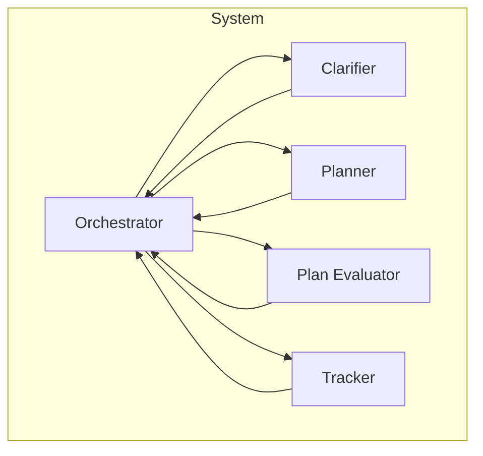

# System Architecture Diagram

This architecture outlines a high-level system that includes the following components:
- **Orchestrator**: Decides which stage to transition to based on current state or input.
- **Clarifier**: Gathers or clarifies requirements or inputs.
- **Planner**: Generates a sequence of tasks or actions.
- **Plan Evaluator**: Evaluates the feasibility and quality of the plan.
- **Tracker**: Monitors execution and progress.

